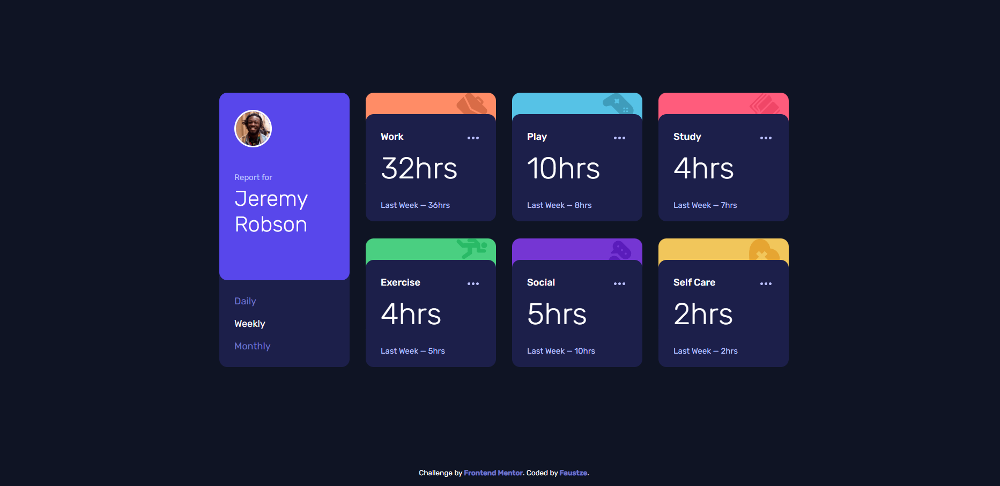

# Frontend Mentor — Time tracking dashboard

## Содержание

- [Обзор](#обзор)
  - [Задача](#задача)
  - [Скриншот](#скриншот)
  - [Ссылки](#ссылки)
- [Мой процесс](#мой-процесс)
  - [Использованные технологии](#использованные-технологии)
  - [Что я изучил](#что-я-изучил)
  - [Дальнейшее развитие](#дальнейшее-развитие)
  - [Полезные ресурсы](#полезные-ресурсы)
  - [AI-сотрудничество](#ai-сотрудничество)
- [Автор](#автор)
- [Благодарности](#благодарности)

## Обзор

Это решение задачи [Time tracking dashboard challenge on Frontend Mentor](https://www.frontendmentor.io/challenges/time-tracking-dashboard-UIQ7167Jw). Проект представляет собой дашборд для отслеживания времени с возможностью переключения между дневной, недельной и месячной статистикой.

### Задача

Пользователи должны иметь возможность:

- Видеть оптимальную раскладку в зависимости от размера экрана устройства
- Видеть hover-состояния для всех интерактивных элементов
- Переключаться между Daily, Weekly и Monthly статистикой

### Скриншот



### Ссылки

- Решение: [GitHub](https://github.com/Faustze/time_tracking_dashboard)
- Деплой: [GitHub Pages](https://faustze.github.io/time_tracking_dashboard)

## Мой процесс

### Использованные технологии

- Семантическая HTML5-разметка
- CSS с кастомными свойствами (CSS custom properties)
- Flexbox и CSS Grid для раскладки
- Мобильный подход (mobile-first)
- SCSS с модульной структурой (@use, @include)
- JavaScript (ES6+, async/await, fetch API)
- Vite для сборки проекта

### Что я изучил

## **CSS Grid и центрирование элементов**

Одной из сложных задач было правильное позиционирование карточек по центру экрана на десктопе. Использовал `align-content: center` с `min-height: 100vh` на grid-контейнере, чтобы карточки располагались по вертикали по центру.

```scss
.dashboard {
  @include mixins.respond-to(desktop) {
    display: grid;
    grid-template-columns: repeat(4, 1fr);
    grid-template-rows: repeat(2, auto);
    align-content: center;
    min-height: 100vh;
  }
}
```

## **Позиционирование баннера карточки**

Интересной задачей было сделать цветной баннер частью карточки так, чтобы он был под `body`, а не перекрывал его. Использовал `position: absolute` для баннера с `z-index: -1`, а `body` — с `position: relative` и `z-index: 1`. Также `overflow: hidden` на карточке обрезает всё, что выходит за скруглённые углы.

```scss
&__card {
  position: relative;
  overflow: hidden;
}

&-banner {
  position: absolute;
  top: 0;
  left: 0;
  right: 0;
  height: 2.375rem;
  z-index: -1;
}

&-body {
  position: relative;
  z-index: 1;
}
```

## **Работа с JSON через fetch API**

Загрузка данных из локального JSON-файла с использованием `async/await` и обработкой ошибок:

```javascript
async function loadData() {
  const response = await fetch("./data.json");
  if (!response.ok) {
    console.log("Response is NOT ok");
    return null;
  }
  return await response.json();
}
```

## **Делегирование событий**

Для переключения периодов использовал делегирование событий — один обработчик на контейнере, а не на каждой кнопке. Это более эффективный подход, особенно при большом количестве элементов.

```javascript
timeframesContainer.addEventListener("click", (e) => {
  const clickedEl = e.target.closest("[data-period]");
  if (clickedEl === null) return;
  currentPeriod = clickedEl.getAttribute("data-period");
  updateActiveButton(timeframesContainer, clickedEl);
  renderCards(currentPeriod);
});
```

## **Валидация входных данных**

В функциях `renderCards` и `loadData` добавил проверки на корректность данных:

```javascript
function renderCards(period) {
  if (!globalData) return;
  if (!["daily", "weekly", "monthly"].includes(period)) return;
  // ...
  const found = globalData.find(
    (obj) => String(obj.title).toLowerCase() === attr,
  );
  if (!found) return;
}
```

## **Работа с ARIA-атрибутами**

При построении дашборда уделил внимание доступности. Использовал ARIA-атрибуты, чтобы сделать интерфейс понятным для вспомогательных технологий (скринридеров):

- `aria-labelledby` связывает профиль пользователя с его именем
- `aria-label` на навигации описывает назначение группы кнопок
- `aria-pressed` на кнопках переключения периодов показывает, какая кнопка сейчас активна (toggle-состояние)
- `role="img"` + `aria-label` на цветных баннерах карточек — баннеры декоративные, но скринридеру нужно знать, к какой карточке они относятся
- `aria-label` на кнопках меню карточек — описывает, к какой карточке относится действие

```html
<section class="dashboard__profile" aria-labelledby="profile-name">...</section>

<nav class="dashboard__profile-timeframes" aria-label="Select time period">
  <button aria-pressed="false">Daily</button>
  <button aria-pressed="true">Weekly</button>
  <button aria-pressed="false">Monthly</button>
</nav>

<div
  class="dashboard__card-banner dashboard__card-banner--work"
  role="img"
  aria-label="Work"
></div>

<button class="dashboard__card-menu" aria-label="More options for Work">
  ...
</button>
```

Ключевой вывод: ARIA не заменяет семантический HTML, а дополняет его. Например, `<nav>` уже семантический элемент, но `aria-label` добавляет контекст — _что именно_ можно выбрать в этой навигации. А `aria-pressed` превращает обычную кнопку в понятный переключатель для скринридера.

### Дальнейшее развитие

- Добавить анимацию при переключении периодов
- Реализовать сохранение выбранного периода в localStorage
- Добавить тесты для JavaScript-функций
- Оптимизировать производительность рендеринга карточек

### Полезные ресурсы

- [MDN Web Docs](https://developer.mozilla.org) — документация по CSS Grid, fetch API, ARIA
- [CSS-Tricks](https://css-tricks.com) — статьи по позиционированию и z-index
- [Frontend Mentor Community](https://www.frontendmentor.io/community) — помощь и фидбек

### AI-сотрудничество

В этом проекте я использовал AI-ассистента (GitHub Copilot / OWL) для:

- Объяснения концепций CSS (Grid, позиционирование, z-index)
- Помощи с отладкой ошибок в JavaScript
- Рефакторинга кода и предложений по улучшению
- Написания документации

AI помог мне лучше понять, почему определённые подходы работают, а другие — нет, особенно в вопросах позиционирования элементов и работы с DOM.

## Автор

- GitHub — [Faustze](https://github.com/Faustze)
- Frontend Mentor — [@Faustze](https://www.frontendmentor.io/profile/Faustze)

## Благодарности

Спасибо Frontend Mentor за интересную задачу и возможность практиковаться в реальных проектах!
